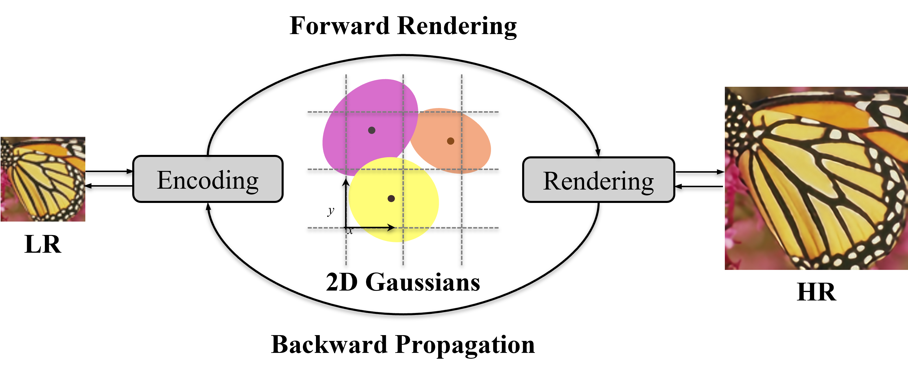
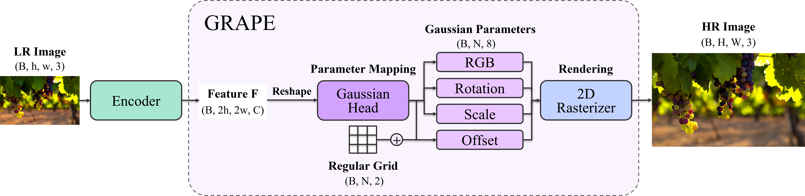

# GRAPE: Gaussian Rendering for Accelerated Pixel Enhancement (Brings Fast and Lightweight Arbitrary Super-Resolution)

<div style="margin-top:8px; font-size: 1.05em;">
  <strong>Jung In Jang</strong><sup>1</sup> &nbsp; · &nbsp;
  <strong>Kyong Hwan Jin</strong><sup>1</sup>
</div>
<div style="margin-top:4px; color:#666;">
  <sup>1</sup>Korea University, Republic of Korea
</div>

<div style="margin-top:14px; display:flex; gap:10px; flex-wrap: wrap;">
  <a class="btn btn-primary" href="static/paper.pdf" target="_blank" rel="noopener">Paper (temp)</a>
  <a class="btn btn-outline-primary" href="https://github.com/mulkkog/GRAPE" target="_blank" rel="noopener">Code (GitHub)</a>
  <a class="btn btn-outline-primary" href="https://youtu.be/LwlF6hZ54ng?si=3xU5rA7_6TXuJssU" target="_blank" rel="noopener">Video (YouTube)</a>
</div>

> **Note**
> - `Paper (temp)` 버튼은 현재 `static/paper.pdf`를 가리키도록 해뒀어. 나중에 PDF를 그 경로에 넣거나 링크를 arXiv로 바꾸면 돼.
> - YouTube 영상은 위 링크로 연결되고, 아래 섹션에는 페이지 내 임베드도 포함했어.

---

## Teaser (Temporary)



<p style="margin-top:6px; color:#666;">
  (Temporary teaser image) Replace <code>static/image/teaser.png</code> with your teaser.
</p>

---

## Abstract

We present <strong>GRAPE (Gaussian Rendering for Accelerated Pixel Enhancement)</strong>, a fast, lightweight method for
<strong>arbitrary-scale super-resolution (ASSR)</strong> based on <strong>2D Gaussian splatting</strong>.
GRAPE predicts anisotropic Gaussian parameters (RGB, rotation, scale, offset) with a compact point-wise layer,
and renders the high-resolution image in <strong>one pass</strong> via a differentiable rasterizer.

---

## Method

### Overview

GRAPE is an end-to-end differentiable pipeline:

1. <strong>Encoder</strong> extracts LR features.  
2. <strong>Gaussian Head (1×1 point-wise)</strong> maps features to anisotropic 2D Gaussian parameters (RGB / rotation / scale / offset).  
3. <strong>2D Rasterizer</strong> renders the SR image efficiently in a single pass.



<p style="margin-top:6px; color:#666;">
  (Temporary) Replace <code>static/image/method.png</code> with your method overview figure.
</p>

---

## Results

### Quantitative (Temporary)


<p style="margin-top:6px; color:#666;">
  (Temporary) Replace <code>static/image/table.png</code> with your quantitative results table/plot.
</p>

### Speed / Efficiency Highlights (Temporary)

- <strong>Params:</strong> 1.56M  
- <strong>Memory:</strong> 1.10 GB  
- <strong>Speed:</strong> 69.33 FPS (Urban100, ×4, avg 985×798)

<p style="margin-top:6px; color:#666;">
  (Temporary) Replace these bullets with the exact final numbers you want to show.
</p>

### Qualitative (Temporary)

<div style="display:grid; grid-template-columns: repeat(2, 1fr); gap:12px; margin-top:12px;">
  
  
  
  
</div>

<p style="margin-top:6px; color:#666;">
  (Temporary) Replace <code>qual_1.png ~ qual_4.png</code> with qualitative comparison images.
</p>

---

## Video

<div style="position:relative;padding-top:56.25%; margin-top:12px;">
  <iframe
    style="position:absolute;top:0;left:0;width:100%;height:100%; border:0;"
    src="https://www.youtube.com/embed/LwlF6hZ54ng"
    title="GRAPE Demo Video"
    allow="accelerometer; autoplay; clipboard-write; encrypted-media; gyroscope; picture-in-picture; web-share"
    allowfullscreen>
  </iframe>
</div>

---

## BibTeX (Temporary)

```bibtex
@article{grape2025,
  title   = {GRAPE: Gaussian Rendering for Accelerated Pixel Enhancement},
  author  = {Jang, Jung In and Jin, Kyong Hwan},
  journal = {arXiv preprint arXiv:XXXX.XXXXX},
  year    = {2025}
}
