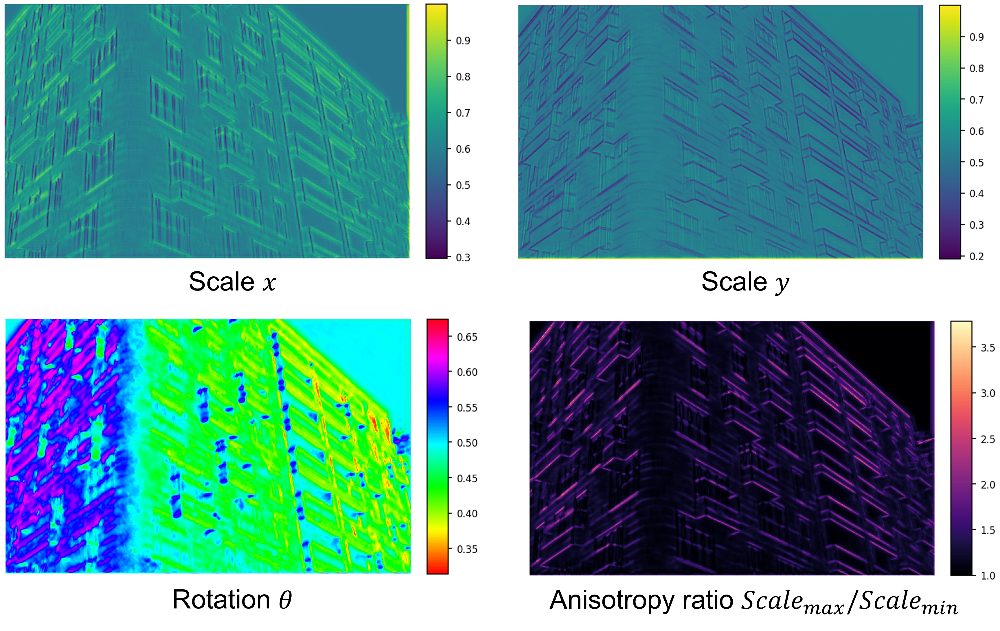
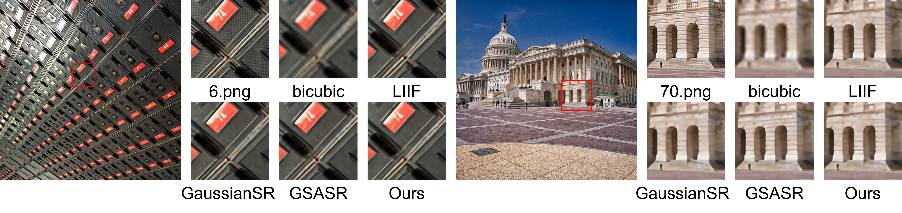
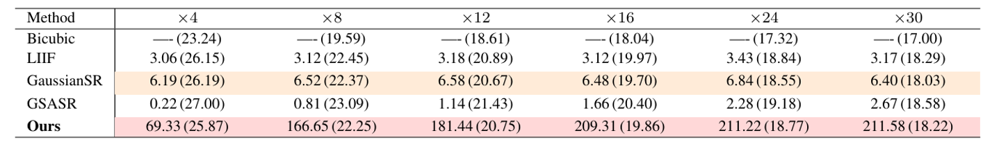
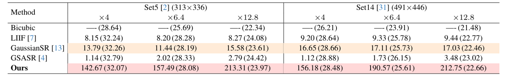
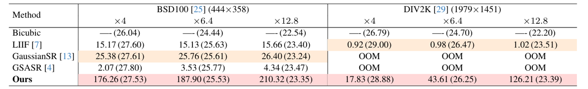
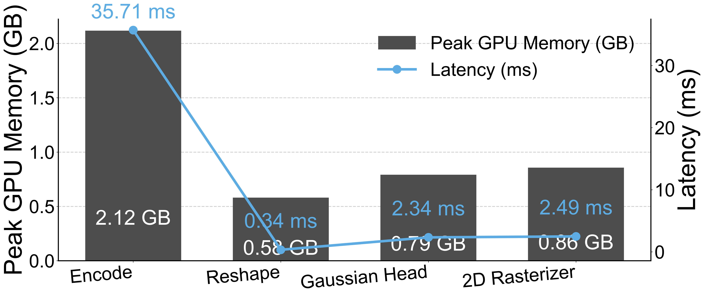

# GRAPE (Gaussian Rendering for Accelerated Pixel Enhancement)  
### Brings Fast and Lightweight Arbitrary Super-Resolution

<div style="margin-top:8px; font-size: 1.05em;">
  <strong>Jung In Jang</strong><sup>1</sup> &nbsp; · &nbsp;
  <strong>Kyong Hwan Jin</strong><sup>1</sup>
</div>
<div style="margin-top:4px; color:#666;">
  <sup>1</sup>Korea University, Republic of Korea
</div>

<div style="margin-top:14px; display:flex; gap:10px; flex-wrap: wrap;">
  <a class="btn btn-primary" href="static/paper.pdf" target="_blank" rel="noopener">Paper (temp)</a>
  <a class="btn btn-outline-primary" href="https://github.com/mulkkog/GRAPE" target="_blank" rel="noopener">Code (GitHub)</a>
  <a class="btn btn-outline-primary" href="https://youtu.be/LwlF6hZ54ng?si=3xU5rA7_6TXuJssU" target="_blank" rel="noopener">Video (YouTube)</a>
</div>

---

## Teaser


<p style="margin-top:6px; color:#666;">
  Replace <code>static/image/teaser.png</code> if you want a different teaser.
</p>

---

## Abstract

GRAPE enables **arbitrary-scale super-resolution (ASSR)** by predicting **2D anisotropic Gaussians** on an image-space grid and **rasterizing them efficiently**.  
By replacing heavy decoders with a **single-layer Gaussian head** and using a **GPU-friendly splatting renderer**, GRAPE supports fast, cache-friendly, and highly parallel inference at arbitrary output resolutions.  
With **1.56M parameters** and **1.10 GB** peak GPU memory, GRAPE runs at **69.33 FPS on Urban100 (985×798)**. :contentReference[oaicite:1]{index=1}

---

## Method

### From LR Features to HR Rendering with Gaussian Primitives

GRAPE is an end-to-end differentiable pipeline:

1. **Encoder** extracts LR features  
2. **Reshape + Parameter Mapping** converts features to a regular grid representation  
3. **Gaussian Head (point-wise)** predicts anisotropic 2D Gaussian parameters (**RGB / Rotation / Scale / Offset**)  
4. **2D Rasterizer** composites Gaussians to render the HR image in one pass :contentReference[oaicite:2]{index=2}


---

## 2D Anisotropic Gaussian Splatting

Oriented elliptical footprints naturally align with edges and directional textures, improving detail reconstruction.  
Below are visualizations of anisotropic parameters (e.g., scale/rotation-related maps). :contentReference[oaicite:3]{index=3}



---

## Results

### Qualitative Results (Urban100 examples)



<p style="margin-top:6px; color:#666;">
  (Figure file: <code>static/image/qual.png</code>)
</p>

---

### Quantitative Results

아래 표들은 포스터에 포함된 정량 결과 테이블 이미지들(파일명 기준)이야. :contentReference[oaicite:4]{index=4}







---

### Stage-wise Peak GPU Memory & Latency

GRAPE는 full-HD 프레임을 **40.88 ms**에 재구성하며, encoder가 전체 런타임의 **85.1%**를 차지하고 나머지 단계는 오버헤드가 작습니다. 또한 peak memory는 **2.12 GB 이하**로 유지됩니다. :contentReference[oaicite:5]{index=5}



---

## Video

<div style="position:relative;padding-top:56.25%; margin-top:12px;">
  <iframe
    style="position:absolute;top:0;left:0;width:100%;height:100%; border:0;"
    src="https://www.youtube.com/embed/LwlF6hZ54ng"
    title="GRAPE Demo Video"
    allow="accelerometer; autoplay; clipboard-write; encrypted-media; gyroscope; picture-in-picture; web-share"
    allowfullscreen>
  </iframe>
</div>

---

## BibTeX (Temporary)

```bibtex
@article{grape2025,
  title   = {GRAPE: Gaussian Rendering for Accelerated Pixel Enhancement},
  author  = {Jang, Jung In and Jin, Kyong Hwan},
  journal = {arXiv preprint arXiv:XXXX.XXXXX},
  year    = {2025}
}

---

## Acknowledgements
This project page is based on an academic project-page template and customized for GRAPE.

